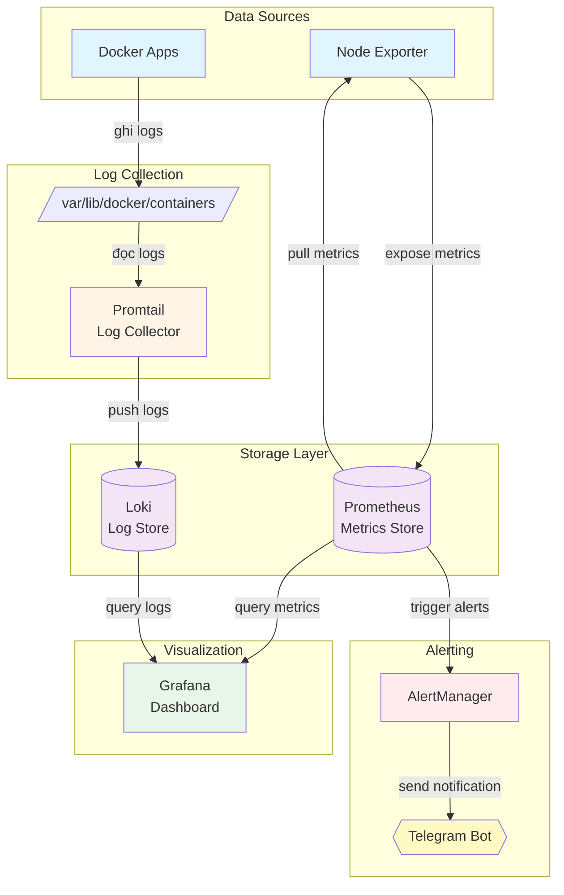
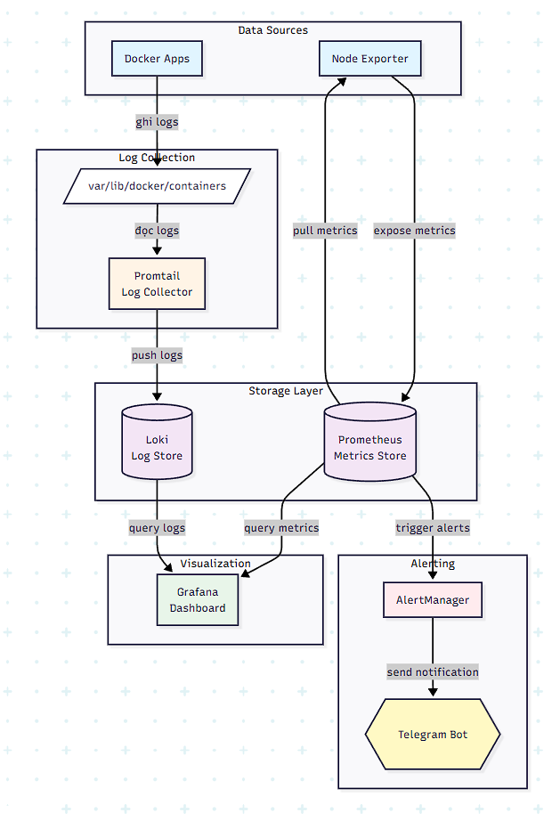
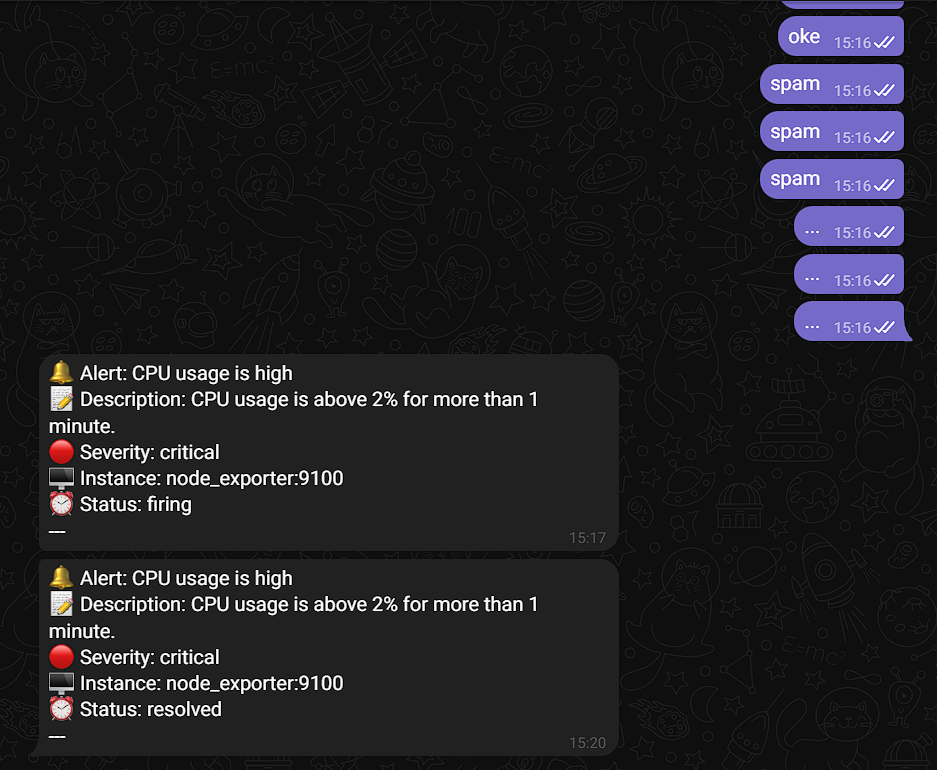

# Monitoring & Alerting System

## 1. Các khái niệm cốt lõi

### 1.1. Monitoring (Giám sát Metrics)
1. **Metric**: Các thông số giám sát (CPU usage, RAM usage, Error rate…)
2. **Time Series Database (TSDB)**: Loại cơ sở dữ liệu chuyên dụng để lưu trữ Metric theo chuỗi thời gian (mỗi giá trị đi kèm một mốc thời gian cụ thể). TSDB giúp truy xuất dữ liệu lớn cực nhanh
3. **Threshold (ngưỡng)**: Giá trị giới hạn được thiết lập. Nếu Metric vượt ngưỡng này (ví dụ CPU > 80%), hệ thống sẽ kích hoạt cảnh báo

### 1.2. Logging (Giám sát Logs)
1. **Log**: Bản ghi chi tiết các sự kiện, hành động, lỗi xảy ra trong hệ thống (request, error messages, debug info…)
2. **Log Aggregation**: Thu thập logs từ nhiều nguồn (containers, servers, apps) về một nơi tập trung để dễ tìm kiếm và phân tích
3. **Log Level**: Mức độ nghiêm trọng của log (DEBUG < INFO < WARN < ERROR < FATAL)
4. **LogQL**: Ngôn ngữ truy vấn logs của Loki (tương tự PromQL cho metrics)

## 2. Tech Stack

### 2.1. Monitoring Stack (Prometheus & Grafana)
- **Exporter**: Các agent cài trên đối tượng cần giám sát (server, database, app) để thu thập dữ liệu thô và cho phép Prometheus lấy dữ liệu
- **Prometheus Server**: "Bộ não" của hệ thống. Thực hiện lấy dữ liệu từ Exporter (Pull mechanism), lưu trữ và xử lý truy vấn
- **PromQL**: Ngôn ngữ truy vấn của Prometheus để tính toán các thông số phức tạp  
- **Alert Manager**: Tiếp nhận các vi phạm ngưỡng từ Prometheus, phân loại và gửi thông báo đến các kênh như Telegram, Email, Slack...
- **Grafana**: Công cụ trực quan hóa dữ liệu (Visualize). Grafana kết nối vào Prometheus để vẽ nên các biểu đồ, dashboard đẹp mắt và dễ hiểu cho người vận hành

### 2.2. Logging Stack (Loki & Promtail)
- **Loki**: Hệ thống log aggregation (tập trung logs), hoạt động như "Prometheus cho logs". Loki chỉ index metadata (labels), không index toàn bộ nội dung log → nhẹ và nhanh hơn Elasticsearch
- **Promtail**: Agent thu thập logs (Log collector), đọc logs từ files, Docker containers, systemd... và đẩy lên Loki
- **LogQL**: Ngôn ngữ truy vấn logs của Loki, cú pháp tương tự PromQL
- **Grafana**: Dùng chung để visualization cả metrics (Prometheus) và logs (Loki)

### 2.3. Luồng hoạt động tổng thể




## 3. Cấu trúc thư mục dự án

```
monitoring-alerting/
├── docker-compose.yml          # Định nghĩa tất cả services
├── prometheus/
│   ├── prometheus.yml          # Cấu hình Prometheus
│   └── alert_rules.yml         # Rules cảnh báo
├── alertmanager/
│   └── alertmanager.yml        # Cấu hình gửi thông báo
├── loki/
│   ├── loki-config.yml         # Cấu hình Loki
│   └── data/                   # Dữ liệu logs (persistent)
├── promtail/
│   └── promtail-config.yml     # Cấu hình Promtail
└── grafana/                    # Dữ liệu Grafana (persistent)
```

## 4. Hướng dẫn triển khai

### 4.1. Khởi động hệ thống

```bash
# Tạo các thư mục cần thiết
mkdir -p prometheus alertmanager loki/data promtail grafana
chmod -R 777 loki/data grafana

# Khởi động tất cả services
docker-compose up -d

# Kiểm tra trạng thái
docker-compose ps

# Xem logs của từng service
docker logs prometheus
docker logs loki
docker logs promtail
docker logs grafana
```

### 4.2. Truy cập các services

| Service | URL | Mô tả |
|---------|-----|-------|
| **Prometheus** | http://localhost:9090 | Query metrics, xem alerts |
| **AlertManager** | http://localhost:9093 | Quản lý alerts |
| **Node Exporter** | http://localhost:9100/metrics | Xem raw metrics |
| **Loki** | http://localhost:3100 | API endpoint (không có UI) |
| **Grafana** | http://localhost:3001 | Dashboard (admin/admin) |

### 4.3. Setup Grafana

#### 4.3.1. Thêm Prometheus Data Source

**Bước 1**: Vào menu bên trái
- Click vào ☰ (hamburger menu)
- Chọn **Connections** → **Data sources**

**Bước 2**: Add Prometheus
- Click **"Add new data source"**
- Chọn **Prometheus**
- Cấu hình:
  ```
  Name: Prometheus
  URL: http://prometheus:9090
  ```
- Để các option khác mặc định
- Click **"Save & Test"** ở cuối trang
- Phải thấy thông báo "Data source is working"

#### 4.3.2. Thêm Loki Data Source

**Bước 1**: Add new data source
- Click **"Add new data source"**
- Chọn **Loki**

**Bước 2**: Cấu hình
```
Name: Loki
URL: http://loki:3100
```
- Click **"Save & Test"**
- Phải thấy "Data source connected and labels found"

#### 4.3.3. Import Dashboard cho Metrics

**Bước 1**: Import Dashboard
- Click ☰ → **Dashboards** → **New** → **Import**

**Bước 2**: Nhập Dashboard ID
Các dashboard phổ biến cho Node Exporter:
```
1860  - Node Exporter Full Dashboard (Khuyến nghị)
11074 - Node Exporter for Prometheus Dashboard  
12486 - Node Exporter Full with Alerts
13978 - Node Exporter Quickstart
```

**Bước 3**: Load và Import
- Nhập ID → Click **"Load"**
- Chọn **Prometheus** data source
- Click **"Import"**

#### 4.3.4. Import Dashboard cho Logs

**Dashboard cho Loki**:
```
13639 - Loki & Promtail (Khuyến nghị)
12019 - Loki Dashboard
```

## 5. Giải thích cấu hình

### 5.1. Cấu hình Loki (`loki/loki-config.yml`)

```yaml
auth_enabled: false
# Tắt xác thực - phù hợp cho môi trường dev/test

server:
  http_listen_port: 3100
  # Port để nhận logs từ Promtail và query từ Grafana

common:
  path_prefix: /loki
  storage:
    filesystem:
      chunks_directory: /loki/chunks  # Lưu chunks data
      rules_directory: /loki/rules    # Lưu alerting rules
  replication_factor: 1
  # Không replicate (single instance)
  ring:
    kvstore:
      store: inmemory
      # Dùng memory store cho ring (đơn giản)

schema_config:
  configs:
    - from: 2020-10-24
      store: tsdb           # Time Series DB
      object_store: filesystem  # Lưu trên filesystem
      schema: v13           # Schema version mới nhất
      index:
        prefix: index_
        period: 24h         # Tạo index mới mỗi 24h

limits_config:
  retention_period: 744h    # Giữ logs trong 31 ngày
  reject_old_samples: true
  reject_old_samples_max_age: 168h  # Từ chối logs cũ hơn 7 ngày
```

### 5.2. Cấu hình Promtail (`promtail/promtail-config.yml`)

```yaml
server:
  http_listen_port: 9080
  # Port để health check và metrics

positions:
  filename: /tmp/positions.yaml
  # Lưu vị trí đã đọc để không đọc lại khi restart

clients:
  - url: http://loki:3100/loki/api/v1/push
    # Địa chỉ để push logs lên Loki

scrape_configs:
  - job_name: containers
    # Tên job để phân biệt nguồn logs
    
    static_configs:
      - targets:
          - localhost
        labels:
          job: containerlogs
          # Label để filter trong Grafana
          __path__: /var/lib/docker/containers/*/*-json.log
          # Pattern match Docker log files
    
    pipeline_stages:
      # Xử lý logs theo pipeline
      
      - json:
          expressions:
            output: log      # Extract field "log" 
            stream: stream   # Extract field "stream" (stdout/stderr)
            time: time       # Extract timestamp
      
      - timestamp:
          source: time
          format: RFC3339Nano
          # Parse timestamp từ Docker logs
      
      - output:
          source: output
          # Đặt nội dung log chính
      
      - labels:
          stream:
          # Tạo label từ stream để filter
```

### 5.3. Giải thích Docker Compose Services

#### Loki Service
```yaml
loki:
  image: grafana/loki:latest
  container_name: loki
  ports:
    - "3100:3100"
    # Expose port để Promtail push logs và Grafana query
  volumes:
    - ./loki/loki-config.yml:/etc/loki/local-config.yaml
      # Mount file config
    - ./loki/data:/loki
      # Mount thư mục data để persistent storage
  command: -config.file=/etc/loki/local-config.yaml
    # Chỉ định file config khi start
```

#### Promtail Service
```yaml
promtail:
  image: grafana/promtail:latest
  container_name: promtail
  user: root
    # CẦN root để đọc Docker logs
  volumes:
    - ./promtail/promtail-config.yml:/etc/promtail/config.yml
      # Mount file config
    - /var/lib/docker/containers:/var/lib/docker/containers:ro
      # Mount Docker logs directory (read-only)
      # :ro = read-only để bảo mật
  command: -config.file=/etc/promtail/config.yml
  depends_on:
    - loki
      # Đảm bảo Loki start trước Promtail
  restart: unless-stopped
    # Auto restart nếu crash
```

## 6. Query Examples

### 6.1. PromQL (Prometheus Metrics)

```promql
# 1. CPU Usage %
100 - (avg(rate(node_cpu_seconds_total{mode="idle"}[5m])) * 100)

# 2. Memory Usage %
(1 - (node_memory_MemAvailable_bytes / node_memory_MemTotal_bytes)) * 100

# 3. Disk Usage %
100 - ((node_filesystem_avail_bytes / node_filesystem_size_bytes) * 100)

# 4. Network Traffic Rate (bytes/sec)
rate(node_network_transmit_bytes_total[5m])

# 5. Disk IOPS (operations/sec)
rate(node_disk_reads_completed_total[5m]) + rate(node_disk_writes_completed_total[5m])
```

### 6.2. LogQL (Loki Logs)

```logql
# 1. Tất cả logs
{job="containerlogs"}

# 2. Chỉ xem ERROR logs
{job="containerlogs"} |= "ERROR"

# 3. Xem ERROR hoặc WARN
{job="containerlogs"} |~ "ERROR|WARN"

# 4. Logs từ stdout (không phải stderr)
{job="containerlogs", stream="stdout"}

# 5. Đếm số errors per minute
sum(count_over_time({job="containerlogs"} |= "ERROR" [1m]))

# 6. Tìm logs chứa "timeout"
{job="containerlogs"} |= "timeout"

# 7. Parse JSON và filter theo level
{job="containerlogs"} | json | level="ERROR"

# 8. Logs trong 5 phút gần đây
{job="containerlogs"} [5m]

# 9. Top 10 log entries
{job="containerlogs"} | limit 10

# 10. Rate of logs per second
rate({job="containerlogs"}[1m])
```

## 7. Cách sử dụng Grafana Explore

### 7.1. Explore Metrics (Prometheus)

1. Click ☰ → **Explore**
2. Chọn **Prometheus** data source
3. Chọn **Metrics browser** → Chọn metric
4. Hoặc gõ trực tiếp PromQL query
5. Click **Run query**
6. Xem biểu đồ ở phía dưới

### 7.2. Explore Logs (Loki)

1. Click ☰ → **Explore**
2. Chọn **Loki** data source
3. Chọn **Label browser**:
   - Chọn `job` = `containerlogs`
   - Chọn `stream` = `stdout` hoặc `stderr`
4. Hoặc gõ LogQL query trực tiếp
5. Click **Run query**
6. Xem logs stream ở phía dưới

### 7.3. Kết hợp Metrics + Logs

Grafana cho phép xem metrics và logs cùng lúc:
1. Click **Split** (icon ở góc phải)
2. Panel trên: Chọn Prometheus → Query metrics
3. Panel dưới: Chọn Loki → Query logs
4. Điều chỉnh time range giống nhau
5. → Thấy correlation giữa metrics spike và error logs

## 8. Troubleshooting

### 8.1. Không thấy logs trong Grafana

```bash
# Kiểm tra Promtail có chạy không
docker logs promtail --tail 50

# Phải thấy: "tail routine: started" và "Seeked /var/lib/docker/containers/..."

# Kiểm tra Loki có nhận logs không
curl http://localhost:3100/loki/api/v1/label

# Phải trả về danh sách labels
```

### 8.2. Promtail báo lỗi permission denied

```bash
# Kiểm tra quyền
ls -la /var/lib/docker/containers/

# Fix: Đảm bảo promtail chạy với user: root trong docker-compose.yml
```

### 8.3. Loki báo lỗi config

```bash
# Kiểm tra logs
docker logs loki

# Kiểm tra syntax YAML
cat loki/loki-config.yml | grep -A 5 "error"

# Restart
docker-compose restart loki
```

### 8.4. Grafana không connect được Loki

```bash
# Test từ Grafana container
docker exec grafana curl http://loki:3100/ready

# Phải trả về: "ready"

# Kiểm tra network
docker network inspect monitoring-alerting_default
```

## 9. Best Practices

### 9.1. Log Retention (Lưu giữ logs)
- Development: 7 ngày
- Staging: 14-30 ngày  
- Production: 30-90 ngày

### 9.2. Log Levels
- **DEBUG**: Chỉ dùng khi debug, không bật ở production
- **INFO**: Logs bình thường, không quá nhiều
- **WARN**: Cảnh báo nhưng hệ thống vẫn hoạt động
- **ERROR**: Lỗi cần xử lý ngay

### 9.3. Label Design
- Dùng labels ít và có cardinality thấp
- BAD: `{user_id="12345"}`  (quá nhiều values)
- GOOD: `{environment="prod", service="api"}`

### 9.4. Query Performance
- Luôn thêm time range cụ thể
- Dùng filters sớm trong pipeline
- `{job="containerlogs"} | json | level="ERROR"`
- `{job="containerlogs", stream="stderr"} |= "ERROR" | json`

## 10. Monitoring Dashboard

### Minh chứng cảnh báo Telegram


### Ví dụ Dashboard Metrics
- CPU Usage: Line chart theo thời gian
- Memory Usage: Gauge chart với threshold
- Disk Usage: Bar chart theo partition
- Network Traffic: Area chart

### Ví dụ Dashboard Logs  
- Log volume: Histogram theo time
- Top errors: Table với count
- Log stream: Logs panel với auto-refresh
- Error rate: Graph so sánh ERROR vs total logs

## 11. Tài liệu tham khảo

- Prometheus: https://prometheus.io/docs/
- Grafana: https://grafana.com/docs/
- Loki: https://grafana.com/docs/loki/latest/
- Promtail: https://grafana.com/docs/loki/latest/clients/promtail/
- PromQL: https://prometheus.io/docs/prometheus/latest/querying/basics/
- LogQL: https://grafana.com/docs/loki/latest/logql/

## 12. Mở rộng

### 12.1. Thêm alerts cho logs
Có thể tạo alerting rules trong Loki để cảnh báo khi:
- Error rate vượt ngưỡng
- Xuất hiện keywords nguy hiểm
- Log volume tăng đột ngột

### 12.2. Tích hợp thêm sources
- Application logs (từ files)
- Syslog
- Kubernetes pods
- Cloud services (AWS CloudWatch, GCP Logging)

### 12.3. Long-term storage
- Loki hỗ trợ S3, GCS để lưu logs dài hạn
- Giảm chi phí storage
- Tăng retention period

---

**Lưu ý**: Đây là setup cho môi trường development/testing. Với production, cần thêm:
- Authentication & Authorization
- TLS/SSL encryption
- High Availability setup
- Backup & Disaster Recovery
- Resource limits & monitoring